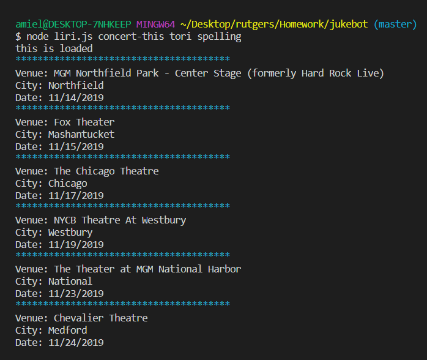
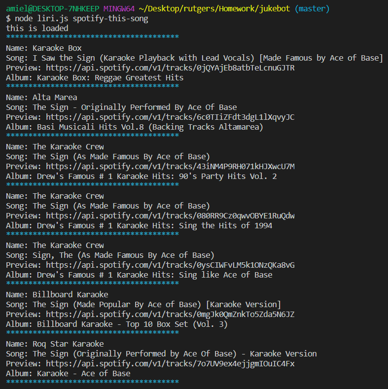
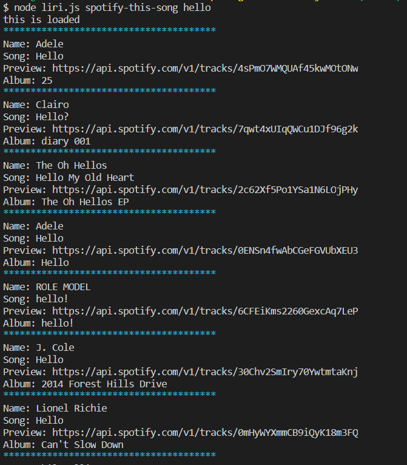
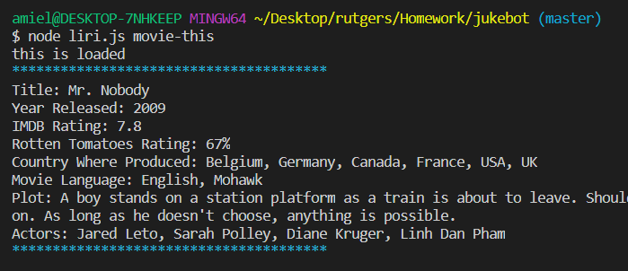
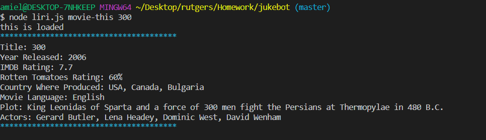
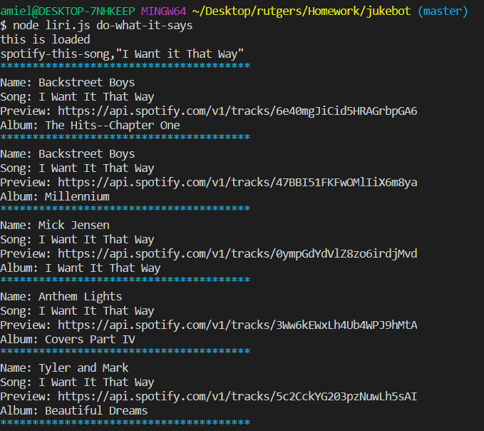

# jukebot

Liri App

LIRI is a Language Interpretation and Recognition Interface. LIRI is a command line node app that takes in parameters and gives you back data.

## Getting Started

Liri may be activated using the following `commands`:

  * `concert-this`

   * `spotify-this-song`

   * `movie-this`

   * `do-what-it-says`

### Prerequisites

You will need to install the following if you would like to make your own LIRI:

```

   * [Node-Spotify-API](https://www.npmjs.com/package/node-spotify-api)

   * [Axios](https://www.npmjs.com/package/axios)

   * [Bands In Town API](http://www.artists.bandsintown.com/bandsintown-api)

   * [Moment](https://www.npmjs.com/package/moment)

   * [DotEnv](https://www.npmjs.com/package/dotenv)
   
```

### How To Use Liri

1. Open your editor.
2. Open `liri.js` file. 

    **Example 1**: The `concert-this` command will search the Bands in Town Artist Events API and log a list of the artist/band, venue name and location, and date of concert. 
    
        node liri.js concert-this '<artist/band name here>'

    

    **Example 2**: The `spotify-this-song` command will search songs and log a list of the artist, song name, preview link, and album. If no song is given, it will default to "The sign" by Ace of Base.
    
        node liri.js spotify-this-song '<name of song>'

    **No Input**
    

    **With Input**
    

    **Example 3**: The `movie-this` command will log the movie's title, year it came out, IMDB and Rotten Tomatoes ratings, country where produced, language, plot, and actors. 
    
        node liri.js movie-this '<name of movie>'

    **No Input**
    

    **With Input**
    


    **Example 4**: The `do-what-it-says` command will take the text out of 'random.txt' and call one of Liri's commands. For this app, it will run ```spotify-this-song``` for "I Want It That Way" by the Backstreet Boys.
        
        node liri.js 'do-what-it-says'

    

## Created By

* **Amiel Nicdao** [GitHub](https://github.com/amielnicdao/jukebot)

**For node.js homework**

## Technologies

* Javascript
* Node.js
* Dependencies:
    * Node-Spotify-API
    * Request
    * Moment
    * DotEnv
* APIs:
    * Bands in Town
    * OMDB

## Acknowledgments

* Instructor
* TAs
* Classmates
